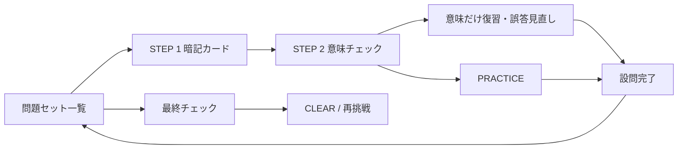

# eiken-practice 状態遷移仕様

対象: `C:\Users\shtom\dev\eiken-q1-practice`

このリポジトリは、英検1級・2級・準2級・準1級の大問1（語彙）だけを扱う独立アプリである。

## 1. データセット

`data/manifest.json` の `q1` に、過去問12セットと1級模試5セットの計17セットを登録する。

| 級 | データセット数 | 通常設問 | 語句数 |
|---|---:|---:|---:|
| 2級 | 3 | 17 | 68 |
| 準2級 | 3 | 15 | 60 |
| 準1級 | 3 | 18 | 72 |
| 1級 | 8 | 22（模試は25） | 88（模試は100） |

準1級の元データは `scripts/build_q1_pre1_data.py` で、2級・準2級と同じ `questions` / `words` 形式へ抽出する。

## 2. 画面状態



### 2.1 通常の1問

| 現在状態 | 操作・条件 | 次状態 | 主な保存値 |
|---|---|---|---|
| `Q1_UNLEARNED` | 問題を開始 | `Q1_FLASH` | `resume.mode=learn`, `stage=flash` |
| `Q1_FLASH` | 4枚のカードを確認 | `Q1_MEANING_CHECK` | `flashIdx` |
| `Q1_MEANING_CHECK` | 意味を回答 | 回答済み表示 | `checkAnswered` |
| `Q1_MEANING_CHECK` | 最終問 | `Q1_PRACTICE` | `stage=practice` |
| `Q1_PRACTICE` | 4択に回答 | `Q1_DONE` | `learned`, `answerResult`, `solvedCorrect`, `wrongCount` |
| `Q1_DONE` | 次の設問を選ぶ | `Q1_UNLEARNED` または一覧 | `resume` を削除 |

本番形式で誤答した場合も `learned=true` になり、`answerResult="incorrect"` として保存する。誤答専用の復習ステージや復習セッションは持たず、最終チェックは全設問の回答後に解放する。旧データの `needsReview` は互換性のため保持するが、専用復習の判定には使わない。

### 2.2 補助セッション

| セッション | 開始条件 | 完了条件 |
|---|---|---|
| `Q1_MEANING` | 「間隔復習カード」から意味練習を選ぶ | 今回の最大30語句に回答。誤答があれば `Q1_MEANING_REVIEW` へ、なければ結果へ |
| `Q1_MEANING_REVIEW` | 意味だけ復習で誤答した語句を暗記カードで確認する | 全件で「確認した」を押すと結果へ。途中状態は `meaningWrongItems` / `meaningWrongChecked` に保存 |
| `Q1_FINAL` | 全設問に回答済み | 全語句の正答率80%以上 |

`Q1_MEANING` は全級共通で、同じ級の3回分を1つのプールとして扱う。対象は通常学習で `learned=true` になった設問の語句だけで、正解するたびに 1日→3日→7日→14日 の間隔で次回へ回る（誤答で「要再確認」に戻る）。語句単位の状態は、その語句が属する回の進捗ブロック `items` に保存する。
意味だけ復習で誤答した英単語・熟語は、同じセッションの最後に暗記カードで見直す。見直しの「確認した」は学習履歴へ記録するが、間隔の判定は意味チェックの誤答結果として扱い、通常学習の設問復習キューは作らない。

## 3. 完了条件

1. 問題セット内の通常設問をすべて回答する（`learned=true`）。
2. 全語句の最終チェックで80%以上を取る。
3. 問題セット単位で `finalCheck.cleared=true` を保存する。

最終チェックの問題数は語句数に依存する。準1級は72語なので、58問以上、1級は88語なので71問以上でCLEARとなる。

## 4. 保存境界

| 領域 | localStorageキー | 所有する状態 |
|---|---|---|
| 問題セット | `eiken_q1_dataset` | 現在選択中の級・回 |
| 大問1進捗 | `eiken_q1_progress_<datasetId>` | 問題別進捗、意味だけ復習の語句状態、学習履歴、最終チェック、再開。旧形式の項目も削除せず保持 |
| 自作英文 | `eiken_q1_examples_<datasetId>` | 語句別の下書き・AIチェック結果 |
| 旧Q1互換 | `eiken2_q1_v1` | 旧Q1のデフォルトセットだけを読むための後方互換 |

クラウド読込時は `{ datasetId: progress }` の形を使う。独立版と総合版のQ1は同一のこの形式を使い、`app_save_progress_dataset` で `app='eiken2-q1'` の行に対して現在の回だけを送信し、Supabase側で既存の別回とマージする。`_meta.lastDatasetId` に最後に選んだ回を保存するため、別端末でも同じ回から再開できる。旧 `app='eiken-q1-practice'` 行は読み書きしないが削除しない。

## 5. 旧準1級進捗の移行

旧 `eiken_pre1_progress_v1.rounds[roundId].questions["reading1:<q>"]` を、次へ移す。

```text
eiken_q1_progress_eikenp1-<roundId>.units[<q>]
```

- 正解済み: `learned=true`, `solvedCorrect=true`
- 誤答済み: `learned=true`, `needsReview=true`（旧データ互換のため値は保持するが、専用復習の判定には使わない）
- 正誤記録: `answerResult="correct"` または `answerResult="incorrect"`
- 旧 `finalCheck`: 新しい `finalCheck` へ移行
- 旧 `eiken-pre1` クラウド進捗: 初回起動時に読み取り、`eiken2-q1` へ保存

移行元のローカルキーとクラウド行は、確認が終わるまで削除しない。

## 6. 不変条件

1. 問題セットを変えても、別セットの進捗を削除しない。
2. 最終チェックは通常設問をすべて回答するまで解放しない。
3. 語彙データの語形と過去問の活用形が異なる場合も、正しい語句の意味を表示する。
4. 完了画面に到達したセッションの再開状態は削除する。
5. 旧形式の進捗移行は一度だけ行い、旧データは残す。
6. `learned=true` だが正誤情報がない旧記録は `answerResult="unknown"` として表示し、誤答扱いにしない。
7. 旧形式の `cumulativeCycle` や未対応の途中記録は削除せず、現行フローから参照しない。
8. 意味だけ復習の誤答見直しを途中離脱した場合は、確認済みの語句を保持し、残りの確認後に結果へ進める。

## 7. 最低限の検証

- `py -3 scripts/check_q1_data.py`
- `node --check static/app.js`
- `node --check static/mode-q1.js`
- 初回起動、17セットの選択、途中再開、意味だけ復習の誤答見直し、誤答後の通常遷移、最終チェック
- 旧準1級ローカル／共有URL進捗の移行
- GitHub Actions成功後の公開HTML・JS・CSS・JSONのHTTP確認
